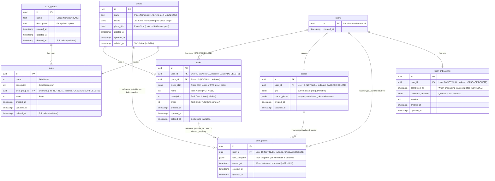

# Types

## piece_skin (JSONB)
```json
{
  "type": "color" | "svg",
  "value": "hex" | "string",
}
```

## boards.placed_pieces (JSONB Array)
```json
[
  {
    "piece": {
      "id": "uuid", // piece.id
      "shape": "2D matrix representing the piece shape",
      "skin": { // piece_skin
        "type": "color" | "svg",
        "value": "hex" | "string",
      }
    },
    "x": "int", // column
    "y": "int", // row
    "rotation": "int",
    "placed_at": "timestamp",
    "task": {
        "name": "string",
        "created_at": "timestamp",
        "completed_at": "timestamp"
    }
  }
]
```
## user_pieces.task_snapshot (JSONB)
```json
{
    "name": "string",
    "created_at": "timestamp",
    "completed_at": "timestamp",
    "piece": {
        "id": "uuid", // piece.id
        "shape": "2D matrix representing the piece shape",
        "skin": { // piece_skin
            "type": "color" | "svg",
            "value": "hex" | "string",
        }
    }
}
```